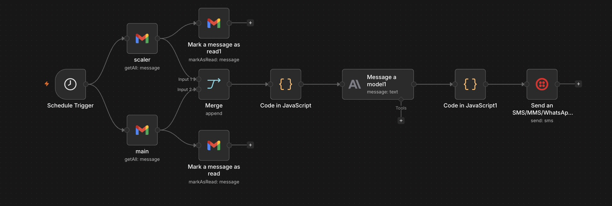
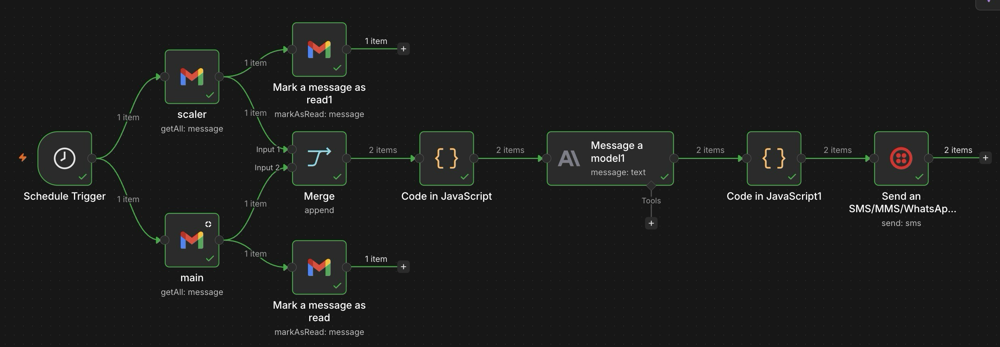
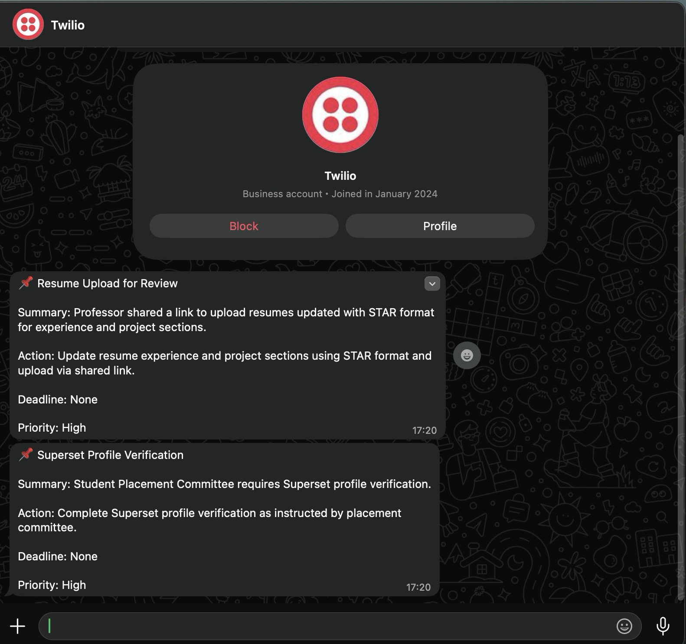

# Gmail Summarizer & Action-Item Extractor

## 1. Problem Statement

### Target User
Students, professionals, and anyone who receives a large volume of emails daily across multiple Gmail accounts.

### Pain Point
Users often miss important emails related to internships, assignments, interviews, meetings, deadlines, and work because their inboxes are flooded with newsletters, promotions, spam, OTPs, and other low-value messages.

### Why It Matters
Missing an important email can lead to missed opportunities, deadlines, or delayed responses. Constantly checking email inboxes is time-consuming and reduces productivity.

### Solution
An AI-powered workflow that automatically collects unread emails from multiple Gmail accounts, filters irrelevant content, extracts actionable information, prioritizes important emails, and sends a concise digest directly to WhatsApp.

### Expected Output
A WhatsApp notification containing:
* Email title
* Short summary
* Action required
* Deadline (if any)
* Priority level

---

## 2. Workflow Breakdown

### Input
* Unread emails from Gmail Account 1
* Unread emails from Gmail Account 2

**Data extracted:**
* Sender
* Subject
* Email body snippet
* Timestamp

---

### Processing Steps

#### Step 1: Schedule Trigger
The workflow runs automatically every 2 hours.

#### Step 2: Gmail Retrieval
Unread emails are fetched from two separate Gmail accounts simultaneously.

#### Step 3: Inbox Cleanup
Retrieved emails are marked as read immediately to avoid duplicate processing.

#### Step 4: Merge Data
Emails from both accounts are combined into a single stream.

#### Step 5: Data Transformation
A JavaScript node extracts only relevant fields:
* Gmail ID
* Sender
* Subject
* Body
* Date

#### Step 6: AI Analysis
Claude Opus 4.6 analyzes all emails and:
* Removes spam
* Removes promotions
* Removes newsletters
* Removes duplicate information
* Extracts action items
* Determines urgency
* Generates structured summaries

#### Step 7: Message Formatting
A JavaScript node extracts the final text response from the AI model output.

#### Step 8: Delivery
Twilio sends the summarized digest to WhatsApp.

---

## 3. Workflow Architecture

Below is the execution flow of the n8n workflow:

### Node Layout


### Successful Execution Run


### High-Level Text Flow
```text
Schedule Trigger
        │
 ┌──────┴──────┐
 │             │
 ▼             ▼
Gmail 1     Gmail 2
 │             │
 ▼             ▼
Mark Read   Mark Read
 │             │
 └──────┬──────┘
        ▼
      Merge
        │
        ▼
 JavaScript
(Data Cleaning)
        │
        ▼
 Claude Opus 4.6
(AI Agent)
        │
        ▼
 JavaScript
(Message Format)
        │
        ▼
 Twilio WhatsApp
```

---

## 4. Agentic Practices Demonstrated

### Agent Role Definition

#### Agent: Email Intelligence Agent
**Responsibilities:**
1. **Email Classification:** Important / Non-important.
2. **Information Extraction:** Key message, Required actions, Deadlines.
3. **Prioritization:** Low, Medium, High, Critical.
4. **Summarization:** Convert long emails into concise actionable summaries.

---

### Structured Output
The AI is instructed to return data in a consistent structure:
```text
📌 Title

Summary: ...

Action: ...

Deadline: ...

Priority: ...

---
```

---

### Tool Usage
* **Gmail API:** Used to retrieve unread emails.
* **Anthropic Claude Opus 4.6:** Used for reasoning and email understanding.
* **Twilio API:** Used to deliver notifications through WhatsApp.
* **JavaScript Nodes:** Used for preprocessing and postprocessing.

---

### Routing & Workflow Control

#### Deterministic Logic
Used for:
* Scheduling execution
* Fetching emails
* Marking emails as read
* Merging data
* Formatting messages
* Sending WhatsApp notifications

#### AI Logic
Used for:
* Spam detection
* Importance classification
* Action extraction
* Priority assignment
* Summarization

This separation ensures AI is only used where reasoning is required.

---

### Fallback Handling

* **Empty Inbox:** If no actionable emails exist, the AI outputs `No important emails found.`
* **Duplicate Prevention:** Emails are marked as read immediately after retrieval.
* **Noise Filtering:** Promotional and irrelevant emails are discarded before reaching the user.

---

## 5. AI vs Deterministic Components

| Component | Type | Purpose |
| :--- | :--- | :--- |
| Schedule Trigger | Deterministic | Run every 2 hours |
| Gmail Fetch Nodes | Deterministic | Retrieve unread emails |
| Mark as Read Nodes | Deterministic | Prevent duplicate processing |
| Merge Node | Deterministic | Combine email streams |
| JavaScript Nodes | Deterministic | Data transformation |
| Claude Opus 4.6 | AI | Email understanding and summarization |
| Twilio WhatsApp | Deterministic | Deliver final notification |

---

## 6. Practical Usefulness
This workflow helps users:
* Reduce inbox overload
* Avoid missing deadlines
* Track internship opportunities
* Monitor assignments
* Receive important updates faster
* Save time spent checking emails

---

## 7. Sample Input

```json
[
  {
    "from": "careers@google.com",
    "subject": "Interview Invitation",
    "body": "Please schedule your interview before June 10."
  }
]
```

---

## 8. Sample Output

```text
📌 Google Interview Invitation

Summary: Google has invited you for an interview.

Action: Schedule interview using provided link.

Deadline: June 10

Priority: Critical
```

### WhatsApp Output Screenshot


---

## 9. Human-in-the-Loop
Although the workflow is automated, the user acts as the final decision-maker.

The user reviews:
* Important emails
* Suggested actions
* Deadlines

and decides whether to act on them.

---

## 10. Future Improvements
1. Add Google Calendar integration for automatic deadline tracking.
2. Store processed emails in PostgreSQL/Supabase.
3. Support Outlook and Yahoo Mail.
4. Add Telegram and Discord notifications.
5. Auto-create tasks in Notion or Todoist.
6. Introduce multiple specialized agents:
   * Internship Agent
   * Assignment Agent
   * Finance Agent
   * Meeting Agent

---

## 11. Individual Contribution
* **Designed:** Overall workflow architecture and multi-account Gmail ingestion system.
* **Implemented:** Gmail integrations, merge logic, JavaScript processing nodes, and Twilio WhatsApp integration.
* **Engineered:** Claude Opus prompt, email classification strategy, priority assignment framework, and action-item extraction methodology.
* **Tested:** End-to-end workflow execution, WhatsApp delivery, and email filtering accuracy.

---

## 12. Learning Outcomes
* Built a complete agentic workflow using n8n.
* Applied AI only where semantic reasoning was required.
* Used deterministic logic for workflow control and validation.
* Integrated multiple external services (Gmail, Anthropic, Twilio).
* Designed a practical productivity-focused automation solution.

---

## Project Structure

```text
Agentic Workflow Design/
│
├── gmail_summarizer_n8n.json             # n8n Workflow JSON export
├── README.md                             # Documentation
├── workflow_image.jpeg                   # Workflow node layout screenshot
├── successful_execution.png              # Successful execution run screenshot
└── output.png                            # WhatsApp output digest screenshot
```

---

## Author
* **Name:** Mayank Gupta
* **Student ID:** 10069
* **Contribution:** Designed and implemented the complete workflow, prompts, routing logic, integrations, and testing.